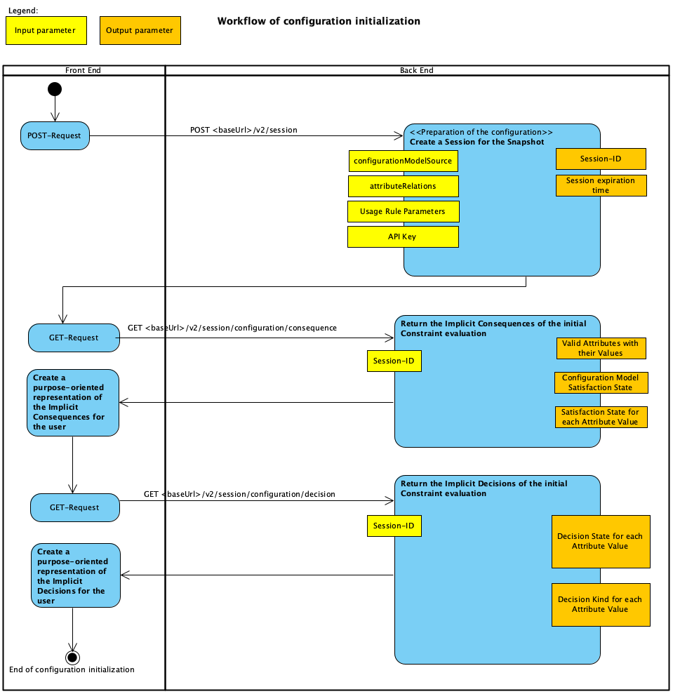
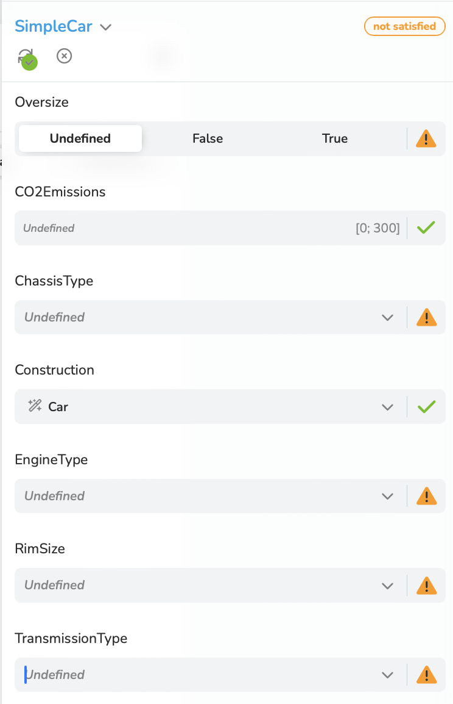

<a id ="initialization"></a>
## 5.2 Initialization of the Configuration Dialogue
From a technical point of view, a [*Configuration Dialogue*](/glossary/#configuration-dialogue) needs to be initialized.
The initialization steps are shown in Figure 5-2:



Figure 5-2: Sequence of events of the initialization workflow (*the picture needs to be updated*)

The initialization starts with a POST request to create a [*Configuration Session*](/glossary/#session) for the [*Configuration Dialogue*](/glossary/#configuration-dialogue).
There are two ways to make a [*Configuration Model*](/glossary/#configuration-model), which generally consists of several
sub models, part of a Configuration Session:

1. A specific deployed model version can be obtained from a specific Channel. This is the variant for the majority of cases.
```
   POST {{baseUrl}}/v2/session
   X-API-KEY: {{engineApiKey}}
   Content-Type: application/json
```
```json
  {
  "configurationModelSource": {
  "type": "Channel",
  "channel": "release",
  "deploymentName": "SimpleAutomobileExample-SimpleCar"
  }
  }
```
The source of the Configuration Model is a certain deployment channel, at the moment only *release*.
The general form of the *deploymentName* is: *configuration project name-configuration model name*.
[*Configuration Projects*](/glossary/#configuration-project) are managed in the Configuration Model Developer - see the documentation "Configuration Model Developer".


2. The nested structure of the sub models can be specified as a "Package" directly in the request body.
```
   POST {{baseUrl}}/engine/v2/session
   X-API-KEY: {{engineApiKey}}
   Content-Type: application/json
```
<a id ="simple-car"></a>
```json
  {
    "configurationModelSource": {
      "type": "Package",
      "configurationModelPackage": {
        "root": "SimpleCar",
        "configurationModels": [
          {
            "configurationModelId": "SimpleCar",
            "sharedToConfigurationModels": [],
            "attributes": {
              "choiceAttributes": [
                {
                  "attributeId": "Construction",
                  "lowerBound": 1,
                  "upperBound": 1,
                  "choiceValues": [
                    {
                      "choiceValueId": "Car"
                    },
                    {
                      "choiceValueId": "Truck"
                    }
                  ]
                },
                {
                  "attributeId": "EngineType",
                  "lowerBound": 1,
                  "upperBound": 1,
                  "choiceValues": [
                    {
                      "choiceValueId": "Burner"
                    },
                    {
                      "choiceValueId": "Electric"
                    }
                  ]
                },
                {
                  "attributeId": "ChassisType",
                  "lowerBound": 1,
                  "upperBound": 1,
                  "choiceValues": [
                    {
                      "choiceValueId": "Comfort"
                    },
                    {
                      "choiceValueId": "Sport"
                    }
                  ]
                },
                {
                  "attributeId": "TransmissionType",
                  "lowerBound": 1,
                  "upperBound": 1,
                  "choiceValues": [
                    {
                      "choiceValueId": "Manual"
                    },
                    {
                      "choiceValueId": "Automatic"
                    }
                  ]
                },
                {
                  "attributeId": "RimSize",
                  "lowerBound": 1,
                  "upperBound": 1,
                  "choiceValues": [
                    {
                      "choiceValueId": "16 inch"
                    },
                    {
                      "choiceValueId": "18 inch"
                    },
                    {
                      "choiceValueId": "25 inch"
                    },
                    {
                      "choiceValueId": "28 inch"
                    }
                  ]
                }
              ],
              "numericAttributes": [
                {
                  "attributeId": "CO2Emissions",
                  "isDecisionRequired": false,
                  "min": 0,
                  "max": 300,
                  "decimalPlaces": 0
                }
              ],
              "booleanAttributes": [
                {
                  "attributeId": "Oversize",
                  "isDecisionRequired": true
                }
              ],
              "componentAttributes": []
            },
            "constraints": [
              {
                "constraintId": "ForPC-ConfiguratorConstructionIsCar",
                "textualConstraint": "Construction.Car"
              },
              {
                "constraintId": "RimExclusionsForPC",
                "textualConstraint": "Construction.Car -> !(RimSize.\"25 inch\" OR RimSize.\"28 inch\")"
              },
              {
                "constraintId": "RimSizeForSmallCO2Emissions",
                "textualConstraint": "CO2Emissions <= 100 -> RimSize.\"16 inch\""
              },
              {
                "constraintId": "OversizeExcludesElectricEngine",
                "textualConstraint": "EngineType.Electric -> Oversize == false"
              },
              {
                "constraintId": "ElectricMeansCO2EmissionsNull",
                "textualConstraint": "EngineType.Electric -> CO2Emissions == 0"
              }
            ]
          }
        ]
      }
    }
  }
````

The response with the code *200* is the same in both cases of providing a Configuration Model:
```json
{
"sessionId": "dmlhbWVkaWNpfGgzWjA3d1ByM2dNY3J5OVFmZ3MET1hUc2dHSEZzSWY=",
"timeout": {
"absolute": "2023-10-04T19:51:06.5851087+00:00",
"slidingInSeconds": 1200
}
}
```

After a Configuration Session has been created, it must be ensured that a [*Configurator*](/glossary/#configurator) can display the available Attributes and
their initial [*Value Decision States*](/glossary/#value-decision-state). For this purpose, the [*Consequences*](/glossary/#consequence) and the
[*Implicit Decisions*] (/glossary/#implicit-decisions) resulting from the initial evaluation of the
Configuration Model are retrieved with a GET requests.

The request to get the Consequences:

GET {{baseUrl}}v2/session/configuration/consequence<br>
X-SESSION-ID: {{sessionId}}<br>
Content-Type: application/json

The response with the code *200* delivers the [*Choice Consequences*](/glossary/#choice-consequence), the [*Numeric Consequences*](/glossary/#numeric-consequence),
the [*Boolean Consequences*](/glossary/#boolean-consequence) and the [*Component Consequences*](/glossary/#component-consequence).
At the beginning of the JSON structure the [*Configuration Model-Satisfaction State*](/glossary/#configuration-model-satisfaction-state) is given ("isSatisfied": false).
In the result of the initial [*Constraint*](/glossary/#constraint) evaluation, the [*Value Decision State*](/glossary/#value-decision-state) for
the value *Car* of the Attribute *Construction* is *Included*, while the value *Truck* is *Excluded*.
The inclusion is the result of an [*Implicit Decisions*](/glossary/#implicit-decision) that lead to the [*Attribute Satisfaction State*](/glossary/#attribute-satisfaction-state) being *true*.
The Values of the other Attributes have the [*Possible Decision States*](/glossary/#possible-decision-state) *Included* and *Excluded*.

```json
{
  "isConfigurationSatisfied": false,
  "choiceConsequences": [
    {
      "attributeId": {
        "localId": "ChassisType",
        "componentPath": []
      },
      "isSatisfied": false,
      "cardinality": {
        "lowerBound": 1,
        "upperBound": 1
      },
      "values": [
        {
          "choiceValueId": "Comfort",
          "possibleDecisionStates": [
            "Included",
            "Excluded"
          ]
        },
        {
          "choiceValueId": "Sport",
          "possibleDecisionStates": [
            "Included",
            "Excluded"
          ]
        }
      ]
    },
    {
      "attributeId": {
        "localId": "Construction",
        "componentPath": []
      },
      "isSatisfied": true,
      "cardinality": {
        "lowerBound": 1,
        "upperBound": 1
      },
      "values": [
        {
          "choiceValueId": "Car",
          "possibleDecisionStates": [
            "Included"
          ]
        },
        {
          "choiceValueId": "Truck",
          "possibleDecisionStates": [
            "Excluded"
          ]
        }
      ]
    },
    {
      "attributeId": {
        "localId": "EngineType",
        "componentPath": []
      },
      "isSatisfied": false,
      "cardinality": {
        "lowerBound": 1,
        "upperBound": 1
      },
      "values": [
        {
          "choiceValueId": "Burner",
          "possibleDecisionStates": [
            "Included",
            "Excluded"
          ]
        },
        {
          "choiceValueId": "Electric",
          "possibleDecisionStates": [
            "Included",
            "Excluded"
          ]
        }
      ]
    },
    {
      "attributeId": {
        "localId": "RimSize",
        "componentPath": []
      },
      "isSatisfied": false,
      "cardinality": {
        "lowerBound": 1,
        "upperBound": 1
      },
      "values": [
        {
          "choiceValueId": "16 inch",
          "possibleDecisionStates": [
            "Included",
            "Excluded"
          ]
        },
        {
          "choiceValueId": "18 inch",
          "possibleDecisionStates": [
            "Included",
            "Excluded"
          ]
        },
        {
          "choiceValueId": "25 inch",
          "possibleDecisionStates": [
            "Excluded"
          ]
        },
        {
          "choiceValueId": "28 inch",
          "possibleDecisionStates": [
            "Excluded"
          ]
        }
      ]
    },
    {
      "attributeId": {
        "localId": "TransmissionType",
        "componentPath": []
      },
      "isSatisfied": false,
      "cardinality": {
        "lowerBound": 1,
        "upperBound": 1
      },
      "values": [
        {
          "choiceValueId": "Automatic",
          "possibleDecisionStates": [
            "Included",
            "Excluded"
          ]
        },
        {
          "choiceValueId": "Manual",
          "possibleDecisionStates": [
            "Included",
            "Excluded"
          ]
        }
      ]
    }
  ],
  "numericConsequences": [
    {
      "attributeId": {
        "localId": "CO2Emissions",
        "componentPath": []
      },
      "isSatisfied": true,
      "selection": "Optional",
      "range": {
        "min": 0,
        "max": 300
      },
      "decimalPlaces": 0
    }
  ],
  "booleanConsequences": [
    {
      "attributeId": {
        "localId": "Oversize",
        "componentPath": []
      },
      "isSatisfied": false,
      "selection": "Mandatory",
      "possibleDecisionStates": [
        false,
        true
      ]
    }
  ],
  "componentConsequences": []
```

The request to query the [*Decisions*](/glossary/#decision) in general, in this case only the
Implicit Decisions because no explicit ones have been made yet:
```
GET {{baseUrl}}v2/session/configuration/decision
X-SESSION-ID: {{sessionId}}
Content-Type: application/json
```
The response with the code *200* delivers the Implicit Decisions of the different types:
[*Choice Decisions*](/glossary/#choice-decision), the [*Numeric Decisions*](/glossary/#numeric-decision),
the [*Boolean Decisions*](/glossary/#boolean-decision) and the [*Component Decisions*](/glossary/#component-decision).
In the result of the initial evaluation of the Constraint *true -> Construction.Car* ,
the value *Car* of the Attribute *Construction* is included by the Configuration Engine.
In this example, this is the only Implicit Decision.

```json
{
"choiceDecisions": [
{
"attributeId": {
"localId": "Construction",
"componentPath": []
},
"values": [
{
"choiceValueId": "Car",
"state": "Included",
"kind": "Implicit"
}
]
}
],
"numericDecisions": [],
"booleanDecisions": [],
"componentDecisions": []
}
```

An exemplary visualization of the initial [*Configuration State*](/glossary/#configuration-state) is shown in figure 5-3.



Figure 5-3: A simple UI for the visualization of the initial Configuration State


