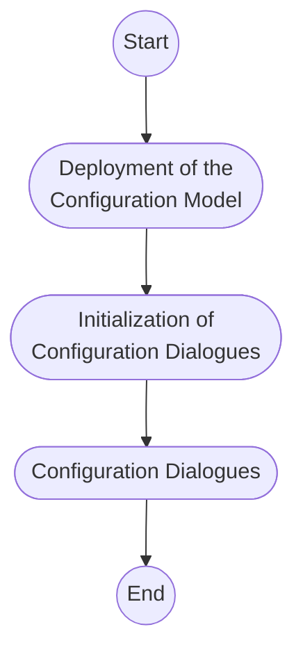

## 5.1 Overview
The steps of a basic configuration workflow are shown in Figure 5-1.

Figure 5-1: Sequence of events of the basic configuration workflow

Step 1, the deployment of a Configuration Model, is presented here
for informational purposes only. It is a step that is executed in the
Configuration Model Developer (refer to the "Configuration Model Developer" documentation).

