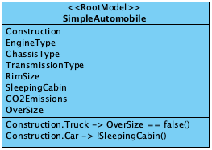

## 4.1 Configuration Model without components

When modeling a real-world product, its characteristics are mapped to
[*Attributes*](/glossary/#attribute).
In the very simple example under consideration here, most Attributes for both simple truck
and a simple car are identical.
There is only one specific Attribute for each: "Over size" for a passenger car and "sleeper cabin" for a truck.
In this simple case, only one [*Configuration Model*](/glossary/#configuration-model) with all Attributes is created. If a passenger car is to be configured,
a [*Rule*](/glossary/#rule) is used to ensure that "Sleeping cabin" is not available. In the case of a truck, "Over size" is
permanently set to "false".

 A graphical representation of the Configuration Model "SimpleAutomobile" is shown in Figure 4-1.


Fig. 4-1: The graphical representation of a Configuration Model for a simple automobile configuration

A JSON representation of the Configuration Model "SimpleAutomobile" is shown in the following code example.

```json
{
  "configurationModelPackage": {
    "root": "SimpleAutomobile",
    "configurationModels": [
      {
        "configurationModelId": "SimpleAutomobile",
        "sharedToConfigurationModels": [],
        "attributes": {
          "choiceAttributes": [
            {
              "attributeId": "Construction",
              "lowerBound": 1,
              "upperBound": 1,
              "attributeValues": [
                {
                  "attributeValueId": "Car"
                },
                {
                  "attributeValueId": "Truck"
                }
              ]
            },
            {
              "attributeId": "EngineType",
              "lowerBound": 1,
              "upperBound": 1,
              "attributeValues": [
                {
                  "attributeValueId": "Burner"
                },
                {
                  "attributeValueId": "Electric"
                }
              ]
            },
            {
              "attributeId": "ChassisType",
              "lowerBound": 1,
              "upperBound": 1,
              "attributeValues": [
                {
                  "attributeValueId": "Comfort"
                },
                {
                  "attributeValueId": "Sport"
                }
              ]
            },
            {
              "attributeId": "TransmissionType",
              "lowerBound": 1,
              "upperBound": 1,
              "attributeValues": [
                {
                  "attributeValueId": "Manual"
                },
                {
                  "attributeValueId": "Automatic"
                }
              ]
            },
            {
              "attributeId": "RimSize",
              "lowerBound": 1,
              "upperBound": 1,
              "attributeValues": [
                {
                  "attributeValueId": "16 inch"
                },
                {
                  "attributeValueId": "18 inch"
                },
                {
                  "attributeValueId": "25 inch"
                },
                {
                  "attributeValueId": "28 inch"
                }
              ]
            },
            {
              "attributeId": "SleepingCabin",
              "lowerBound": 1,
              "upperBound": 1,
              "choiceValues": [
                {
                  "choiceValueId": "1 bed"
                },
                {
                  "choiceValueId": "2 beds"
                }
              ]
            }
          ],

          "numericAttributes": [
            {
              "attributeId": "CO2Emissions",
              "isDecisionRequired": false,
              "min": 0,
              "max": 300,
              "decimalPlaces": 0
            }
          ],
          "booleanAttributes": [
            {
              "attributeId": "Oversize",
              "isDecisionRequired": true
            }
          ],
          "componentAttributes": []
        },
        "constraints": [
          {
            "constraintId": "SeepingCabinExclusionForPC",
            "textualConstraint": "Construction.PC -> !SleepingCabin.*"
          },
          {
            "constraintId": "OverSizeExclusionForTruck",
            "textualConstraint": "Construction.Truck -> OverSize == false"
          },
          {
            "constraintId": "RimExclusionsForPC",
            "textualConstraint": "Construction.PC -> !(RimSize.\"25 inch\" OR RimSize.\"28 inch\")"
          },
          {
            "constraintId": "RimSizeForSmallCO2Emissions",
            "textualConstraint": "CO2Emissions <= 100 -> RimSize.\"16 inch\""
          }
        ]
      }
    ]
  }
}
```
