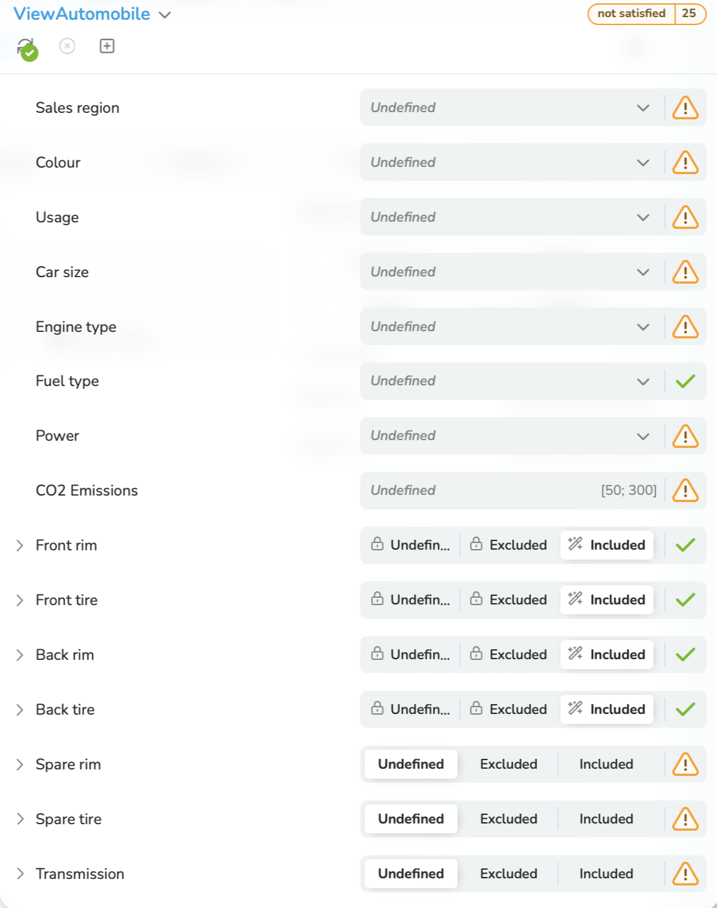
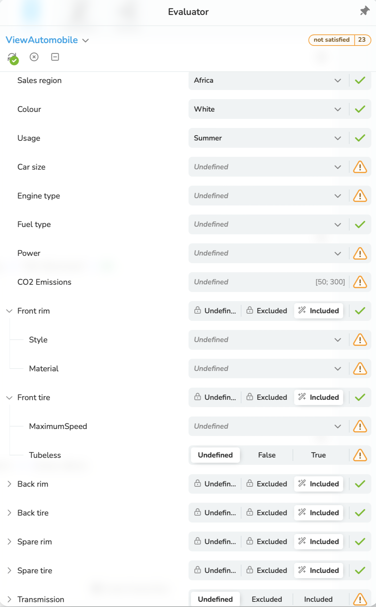
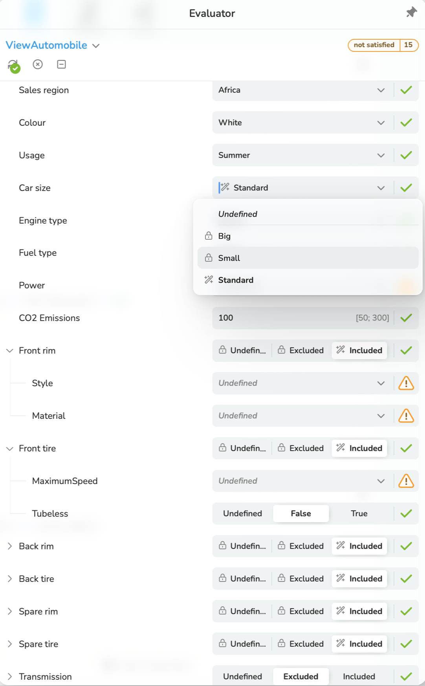

<a id = "dialogue"></a>
## 6.2.1 Configuration Dialogue with Components

It is assumed that a [*Configuration Session*](/glossary/#configuration-session) has been created
and a [*Configuration Dialogue*](/glossary/#configuration-dialogue) has been initialized with the
Configuration Model ["Car"](/exemplary-configuration-dialogues/with-comp/#car).

A simple UI shows the visualization of the initial Configurator State in Figure 6.3.



Figure 6-3: A simple UI for the visualization of the Configuration State after the initialization
of a Configuration Dialogue

Now we make three [*Decisions*](/glossary/#decision) one after the other.

At first a [*Choice Decision*](/glossary/#choice-decision) in the
[*Shared Configuration Model*](/glossary/#shared-configuration-model) "SalesShared".

<a id = "decision1"></a>
#### Decision 1

```
PUT {{baseUrl}}/engine/v2/session/configuration/decision
X-SESSION-ID: {{sessionId}}
Content-Type: application/json
```
```json
{
  "type": "Choice",
  "attributeId": {
    "localId": "SalesRegion",
    "sharedConfigurationModelId": "SalesShared",
    "componentPath": []
  },
  "choiceValueId": "Africa",
  "state": "Included"
}
```

Now a Choice Decision in the [*Component Configuration Model*](/glossary/#component-configuration-model) "Automobile".

<a id = "decision2"></a>
#### Decision 2

```
PUT {{baseUrl}}/engine/v2/session/configuration/decision
X-SESSION-ID: {{sessionId}}
Content-Type: application/json
```
```json
{
    "type": "Choice",
    "attributeId": {
        "localId": "Colour",
        "componentPath": ["Automobile"]
    },
    "choiceValueId": "White",
    "state": "Included"
}
```

And thirdly a Choice Decision in the Shared Configuration Model "Technical Shared".

<a id = "decision3"></a>
#### Decision 3

```
PUT {{baseUrl}}/engine/v2/session/configuration/decision
X-SESSION-ID: {{sessionId}}
Content-Type: application/json
```
```json
{
    "type": "Choice",
    "attributeId": {
        "localId": "Usage",
        "sharedConfigurationModelId": "TechnicalShared",
        "componentPath": []
    },
    "choiceValueId": "Summer",
    "state": "Included"
}
```

The [*Consequences*](/glossary/#consequence) of the [*Decisions*](/glossary/#decision) are delivered
by the response of the following request:

```
GET {{baseUrl}}/engine/v2/session/configuration/consequence
X-SESSION-ID: {{sessionId}}
Content-Type: application/json
```
Only those Consequences that are attributable to the evaluation of [*Rules*](/glossary/#rule) are explained below.
Attribute Values that can be both included and excluded are not considered.
Only the relevant sections of the JSON structure are shown. The complete JSON file can be found
[*here*](/exemplary-configuration-dialogues/with-comp/consequences/#consequences-of-the-decisions-1-to-3).

```json
{
  "attributeId": {
    "localId": "CarSize",
    "componentPath": []
  },
  "values": [
    {
      "choiceValueId": "Small",
      "possibleDecisionStates": [
        "Excluded"
      ]
    }
  ]
}
```
Reasons for "Excluded":
[*Decision 2*](#decision2),
[*Rule 1*](/exemplary-configuration-dialogues/with-comp/rules/#rule1),
[*Rule 3*](/exemplary-configuration-dialogues/with-comp/rules/#rule3)
```json
{
  "attributeId": {
    "localId": "Style",
    "componentPath": [
      "Automobile",
      "BackWheels",
      "Rim"
    ]
  },
  "values": [
    {
      "choiceValueId": "TRX1",
      "possibleDecisionStates": [
        "Excluded"
      ]
    },
    {
      "choiceValueId": "TRX2",
      "possibleDecisionStates": [
        "Excluded"
      ]
    }
  ]
}
```
Reasons for "Excluded":
[*Rule 1*](/exemplary-configuration-dialogues/with-comp/rules/#rule1),
[*Rule 23*](/exemplary-configuration-dialogues/with-comp/rules/#rule23)
```json
{
  "attributeId": {
    "localId": "MaximumSpeed",
    "componentPath": [
      "Automobile",
      "BackWheels",
      "Tire"
    ]
  },
  "values": [
    {
      "choiceValueId": "100",
      "possibleDecisionStates": [
        "Excluded"
      ]
    }
  ]
}
```
Reasons for "Excluded":
[*Rule 1*](/exemplary-configuration-dialogues/with-comp/rules/#rule1),
[*Rule 24*](/exemplary-configuration-dialogues/with-comp/rules/#rule24)
```json
{
  "choiceValueId": "200",
  "possibleDecisionStates": [
    "Excluded"
  ]
}
```
Reasons for "Excluded":
[*Decision 1*](#decision1),
[*Rule 25*](/exemplary-configuration-dialogues/with-comp/rules/#rule25)
```json
{
  "choiceValueId": "180",
  "possibleDecisionStates": [
    "Included"
  ]
}
```
Reasons for "Included":
(1) A choice of one value is mandatory. (2) 180 is the only remaining value, it is implicitly included.
```json
{
  "attributeId": {
    "localId": "EngineType",
    "componentPath": [
      "Automobile",
      "Engine"
    ]
  },
  "values": [
    {
      "choiceValueId": "Hybrid",
      "possibleDecisionStates": [
        "Excluded"
      ]
    }
  ]
}
```
Reasons for "Excluded":
[*Decision 1*](#decision1),
[*Rule 19*](/exemplary-configuration-dialogues/with-comp/rules/#rule19)
```json
{
  "attributeId": {
    "localId": "SalesRegion",
    "sharedConfigurationModelId": "SalesShared",
    "componentPath": []
  },
  "values": [
    {
      "choiceValueId": "China",
      "possibleDecisionStates": [
        "Excluded"
      ]
    }
  ]
}
```
Reasons for "Excluded":
[*Decision 2*](#decision2),
[*Rule 18*](/exemplary-configuration-dialogues/with-comp/rules/#rule18)
```json
{
  "attributeId": {
    "localId": "Construction",
    "sharedConfigurationModelId": "TechnicalShared",
    "componentPath": []
  },
  "values": [
    {
      "choiceValueId": "Car",
      "possibleDecisionStates": [
        "Included"
      ]
    },
    {
      "choiceValueId": "Truck",
      "possibleDecisionStates": [
        "Excluded"
      ]
    }
  ]
}
```
Reason for "Included":
[*Rule 1*](/exemplary-configuration-dialogues/with-comp/rules/#rule1)

Reasons for "Excluded":
(1) A choice of ONE value is mandatory.
(2) "Car" has been included.
(3) "Truck" is the only remaining value, it is implicitly excluded.
```json
 {
  "attributeId": {
    "localId": "Usage",
    "sharedConfigurationModelId": "TechnicalShared",
    "componentPath": []
  },
  "values": [
    {
      "choiceValueId": "Winter",
      "possibleDecisionStates": [
        "Excluded"
      ]
    }
  ]
}
```
Reasons for "Excluded":
[*Decision 1*](#decision1),
[*Rule 19*](/exemplary-configuration-dialogues/with-comp/rules/#rule19)

**"componentConsequences":** [
```json
{
"attributeId": {
"localId": "Automobile",
"componentPath": []
},
"possibleDecisionStates": [
"Included"
]
```
Reason for "Included":
The reference to a [*Component Configuration Model*](/glossary/#component-configuration-model) with
the local identifier "Automobile" has been declared as "always included" in the
[*Root Configuration Model*](/glossary/#root-configuration-model) "Car".
```json
"attributeId": {
"localId": "BackWheels",
"componentPath": [
"Automobile"
]
},
"possibleDecisionStates": [
"Included"
]
```
Reason for "Included":
The [*Component Configuration Model*](/glossary/#component-configuration-model) with
the Configuration Model Identifier "Wheel" has been declared as "always included" in the
Component Configuration Model with the identifier "Automobile".
The identifier of the [*Component Attribute*](/glossary/#component-attribute) is "BackWheels".

This explanation also applies to "FrontWheels"below.
```json
"attributeId": {
"localId": "FrontWheels",
"componentPath": [
"Automobile"
]
},
"possibleDecisionStates": [
"Included"
]
```
```json
"attributeId": {
"localId": "Engine",
"componentPath": [
"Automobile"
]
},
"possibleDecisionStates": [
"Included"
]
```
Reason for "Included":
The [*Component Configuration Model*](/glossary/#component-configuration-model) with
the Configuration Model Identifier "Engine" has been declared as "always included" in the
Component Configuration Model with the identifier "Automobile".
The identifier of the [*Component Attribute*](/glossary/#component-attribute) is "Engine".
```json
"attributeId": {
"localId": "SpareWheel",
"componentPath": [
"Automobile"
]
},
"inclusion": "Optional",
"selection": "Optional",
"possibleDecisionStates": [
"Included"
]
```
Reason for "Included":
The [*Component Configuration Model*](/glossary/#component-configuration-model) with
the Configuration Model Identifier "Wheel" has been declared as "optional included" in the
Component Configuration Model with the identifier "Automobile".
The identifier of the [*Component Attribute*](/glossary/#component-attribute) is "SpareWheel".

Due to [*Decision 1*](#decision1) and
[*Rule 19*](/exemplary-configuration-dialogues/with-comp/rules/#rule19), only "included" is currently possible.

__"selection": "Optional"__ means that the selection of the Attribute with the identifier "SpareWheel" is optional
in a [*Configurator*](/glossary/#configurator). The user does not have to make a [*Decision*](/glossary/#decision).
```json
"attributeId": {
"localId": "Transmission",
"componentPath": [
"Automobile"
]
},
"inclusion": "Optional",
"selection": "Optional",
"possibleDecisionStates": [
"Included",
"Excluded"
]
```
Reason for "Included", "Excluded":
The [*Component Configuration Model*](/glossary/#component-configuration-model) with
the Configuration Model Identifier "Transmission" has been declared as "optional included" in the
Component Configuration Model with the identifier "Automobile".
The identifier of the [*Component Attribute*](/glossary/#component-attribute) is "Transmission".

Based on the [*Decisions*](/glossary/#decision) made to date, both "Included" and "Excluded" are still possible.

BTW: "Transmission" plays a role in [*Rule 12*](/exemplary-configuration-dialogues/with-comp/rules/#rule12) and in
[*Rule 15*](/exemplary-configuration-dialogues/with-comp/rules/#rule15).

The explanation of the following [*Decision states*](/glossary/#decision-state) is analogous to the explanations given above.
The only difference: The referencing of a [*Component Configuration Model*](/glossary/#component-configuration-model) - e.g. "Rim" - takes place one level lower -
e.g. "Automobile", "FrontWheels".

```json
"attributeId": {
"localId": "Rim",
"componentPath": [
"Automobile",
"BackWheels"
]
},
"inclusion": "Always",
"possibleDecisionStates": [
"Included"
]
```
```json
"attributeId": {
"localId": "Tire",
"componentPath": [
"Automobile",
"BackWheels"
]
},
"inclusion": "Always",
"possibleDecisionStates": [
"Included"
]
```
```json
"attributeId": {
"localId": "Rim",
"componentPath": [
"Automobile",
"FrontWheels"
]
},
"isSatisfied": true,
"inclusion": "Always",
"possibleDecisionStates": [
"Included"
]
},
{
"attributeId": {
"localId": "Tire",
"componentPath": [
"Automobile",
"FrontWheels"
]
},
"isSatisfied": true,
"inclusion": "Always",
"possibleDecisionStates": [
"Included"
]
},
{
"attributeId": {
"localId": "Rim",
"componentPath": [
"Automobile",
"SpareWheel"
]
},
"isSatisfied": true,
"inclusion": "Always",
"possibleDecisionStates": [
"Included"
]
},
{
"attributeId": {
"localId": "Tire",
"componentPath": [
"Automobile",
"SpareWheel"
]
},
"isSatisfied": true,
"inclusion": "Always",
"possibleDecisionStates": [
"Included"
]
}
]
}
```


Figure 6-4: A simple UI for the visualization of the Configuration State after the three
[*Decisions*](/glossary/#decision) above

Please note at this point: The layout of view elements is completely independent from the structure of the Configuration Model.

Now a [*Numeric Decision*](/glossary/#numeric-decision) in the [*Root Configuration Model*](/glossary/#root-configuration-model) "Car".

<a id = "decision4"></a>
#### Decision 4

```
PUT {{baseUrl}}/engine/v2/session/configuration/decision
X-SESSION-ID: {{sessionId}}
Content-Type: application/json
```
```json
{
    "type": "Numeric",
    "attributeId": {
        "localId": "CO2Emissions",
        "componentPath": []
    },
    "state": "100"
}
```
The [*Consequences*](/glossary/#consequence) of this Decision are delivered
by the response of the request above. Here the most important section:
```json
"choiceConsequences": [
      {
        "attributeId": {
          "localId": "CarSize",
          "componentPath": []
        },
        "isSatisfied": true,
        "cardinality": {
          "lowerBound": 1,
          "upperBound": 1
        },
        "values": [
          {
            "choiceValueId": "Big",
            "possibleDecisionStates": [
              "Excluded"
            ]
          },
          {
            "choiceValueId": "Small",
            "possibleDecisionStates": [
              "Excluded"
            ]
          },
          {
            "choiceValueId": "Standard",
            "possibleDecisionStates": [
              "Included"
            ]
          }
        ]
      }
    ]
```
Compared to the Consequences above, "Big" is now also excluded and "Standard" is included.

Reasons for the exclusion of "Big":

[*Decision 4*](#decision4),
[*Rule 2*](/exemplary-configuration-dialogues/with-comp/rules/#rule2)

Reasons for the inclusion of "Standard":

(1) A choice of ONE value is mandatory.

(2) "Standard" is the only remaining value, it is implicitly included.

With larger quantities of [*Rules*](/glossary/#rule), the causes of inclusions or exclusions are not so easy to recognise.
This is why there is an Explain function. Let us take as an example of why "Big" is excluded:
```
POST {{baseUrl}}/engine/v2/session/configuration/consequence/explain/why-state-not-possible
X-SESSION-ID: {{sessionId}}
Content-Type: application/json
```
```json
{
    "type": "ChoiceValue",
    "attributeId": {
        "localId": "CarSize",
        "componentPath": []
    },
    "choiceValueId": "Big",
    "state": "Included"
}
```
The response is self-explanatory:
```json
{
  "constraintExplanations": [
    {
      "causedByCardinalities": [],
      "causedByRules": [
        {
          "type": "Rule",
          "constraintId": {
            "localId": "Rule2:ForBigSizeCO2EmissionGreaterThan200",
            "configurationModelId": "Car"
          }
        }
      ]
    }
  ],
  "decisionExplanations": [
    {
      "causedByChoiceDecisions": [],
      "causedByNumericDecisions": [
        {
          "type": "Numeric",
          "state": 100.0,
          "attributeId": {
            "localId": "CO2Emissions",
            "componentPath": []
          },
          "reason": "StateNotPossible"
        }
      ],
      "causedByBooleanDecisions": [],
      "causedByComponentDecisions": []
    }
  ]
}
```
After Decision 4 (CO2Emissions = 100), [*Rule 2*](/exemplary-configuration-dialogues/with-comp/rules/#rule2) applies and excludes "Big".

We will now make the following Decisions one after the other in this example Configuration Dialogue:

<a id = "decision5"></a>
#### Decision 5

```
PUT {{baseUrl}}/engine/v2/session/configuration/decision
X-SESSION-ID: {{sessionId}}
Content-Type: application/json
```
```json
{
  "type": "Choice",
  "attributeId": {
    "localId": "EngineType",
    "componentPath": ["Automobile", "Engine"]
  },
  "choiceValueId": "Burner",
  "state": "Included"
}
```

<a id = "decision6"></a>
#### Decision 6

```
PUT {{baseUrl}}/engine/v2/session/configuration/decision
X-SESSION-ID: {{sessionId}}
Content-Type: application/json
```
```json
{
  "type": "Choice",
  "attributeId": {
    "localId": "FuelType",
    "componentPath": ["Automobile", "Engine"]
  },
  "choiceValueId": "Petrol",
  "state": "Included"
}
```
<a id = "decision7"></a>
#### Decision 7
```
PUT {{baseUrl}}/engine/v2/session/configuration/decision
X-SESSION-ID: {{sessionId}}
Content-Type: application/json
```
```json
{
  "type": "Choice",
  "attributeId": {
    "localId": "Size",
    "sharedConfigurationModelId": "TechnicalShared",
    "componentPath": []
  },
  "choiceValueId": "16 inch",
  "state": "Included"
}
```
<a id = "decision8"></a>
#### Decision 8
A [*Boolean Decision*](/glossary/#boolean-decision) in the
[*Shared Configuration Model*](/glossary/#shared-configuration-model) "TechnicalShared".
```
PUT {{baseUrl}}/engine/v2/session/configuration/decision
X-SESSION-ID: {{sessionId}}
Content-Type: application/json
```
```json
{
  "type": "Boolean",
  "attributeId": {
    "localId": "Tubeless",
    "sharedConfigurationModelId": "TechnicalShared",
    "componentPath": []
  },
  "state": false
}
```
<a id = "decision9"></a>
#### Decision 9
```
PUT {{baseUrl}}/engine/v2/session/configuration/decision
X-SESSION-ID: {{sessionId}}
Content-Type: application/json
```
```json
{
  "type": "Choice",
  "attributeId": {
    "localId": "NumberOfWheels",
    "componentPath": ["Automobile"]
  },
  "choiceValueId": "3",
  "state": "Included"
}
```
And now a decision regarding one [*Component*](/glossary/#component):

<a id = "decision10"></a>
#### Decision 10
json
PUT {{baseUrl}}/engine/v2/session/configuration/decision
X-SESSION-ID: {{sessionId}}
Content-Type: application/json
```
```json
{
  "type": "Component",
  "attributeId": {
    "localId": "Transmission",
    "componentPath": ["Automobile"]
  },
  "state": "Excluded"
}
```

After the above decisions, the Configuration is not yet satisfied, as shown in figure 6-5:



Figure 6-5: A simple UI for the visualization of the Configuration State after the ten
[*Decisions*](/glossary/#decision) above

The reasons can be get by the following request:
```
POST {{baseUrl}}/engine/v2/session/configuration/consequence/explain/why-not-satisfied
X-SESSION-ID: {{sessionId}}
Content-Type: application/json
```
```json
{
    "type": "Configuration"
}
```
The response:
```json
{
  "constraintExplanations": [
    {
      "causedByCardinalities": [
        {
          "type": "Cardinality",
          "attributeId": {
            "localId": "NumberOfWheels",
            "componentPath": [
              "Automobile"
            ]
          }
        },
        {
          "type": "Cardinality",
          "attributeId": {
            "localId": "Style",
            "componentPath": [
              "Automobile",
              "FrontWheels",
              "Rim"
            ]
          }
        },
        {
          "type": "Cardinality",
          "attributeId": {
            "localId": "Number",
            "componentPath": [
              "Automobile",
              "BackWheels"
            ]
          }
        },
        {
          "type": "Cardinality",
          "attributeId": {
            "localId": "Material",
            "componentPath": [
              "Automobile",
              "SpareWheel",
              "Rim"
            ]
          }
        },
        {
          "type": "Cardinality",
          "attributeId": {
            "localId": "Material",
            "componentPath": [
              "Automobile",
              "BackWheels",
              "Rim"
            ]
          }
        },
        {
          "type": "Cardinality",
          "attributeId": {
            "localId": "Power",
            "componentPath": [
              "Automobile",
              "Engine"
            ]
          }
        },
        {
          "type": "Cardinality",
          "attributeId": {
            "localId": "Material",
            "componentPath": [
              "Automobile",
              "FrontWheels",
              "Rim"
            ]
          }
        },
        {
          "type": "Cardinality",
          "attributeId": {
            "localId": "Number",
            "componentPath": [
              "Automobile",
              "SpareWheel"
            ]
          }
        },
        {
          "type": "Cardinality",
          "attributeId": {
            "localId": "CustomerCategory",
            "sharedConfigurationModelId": "SalesShared",
            "componentPath": []
          }
        },
        {
          "type": "Cardinality",
          "attributeId": {
            "localId": "Style",
            "componentPath": [
              "Automobile",
              "SpareWheel",
              "Rim"
            ]
          }
        },
        {
          "type": "Cardinality",
          "attributeId": {
            "localId": "Number",
            "componentPath": [
              "Automobile",
              "FrontWheels"
            ]
          }
        },
        {
          "type": "Cardinality",
          "attributeId": {
            "localId": "Style",
            "componentPath": [
              "Automobile",
              "BackWheels",
              "Rim"
            ]
          }
        }
      ],
      "causedByRules": []
    }
  ],
  "decisionExplanations": []
}
```
The Attributes listed in the response have all the [*Cardinality*](/glossary/#cardinality) (1 ... 1),
i.e. at least one Value must be assigned (selected in a UI). No Values have yet been assigned for these Attributes.
Therefore, the configuration is not satisfied yet. In other words, the
[*Configuration-Model-Satisfaction-State*](/glossary/#configuration-model-satisfaction-state) is "false".

Figure 6.5 also shows that the Values "Big" and "Small" for the Attribute "Car size"
can no longer selected. In Chapter 8, we will get an [*Explanation*](/glossary/#explanation)
for this from the [*Configuration Engine*](/glossary/#configuration-engine).


