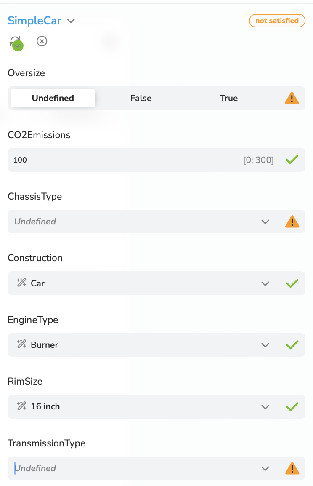
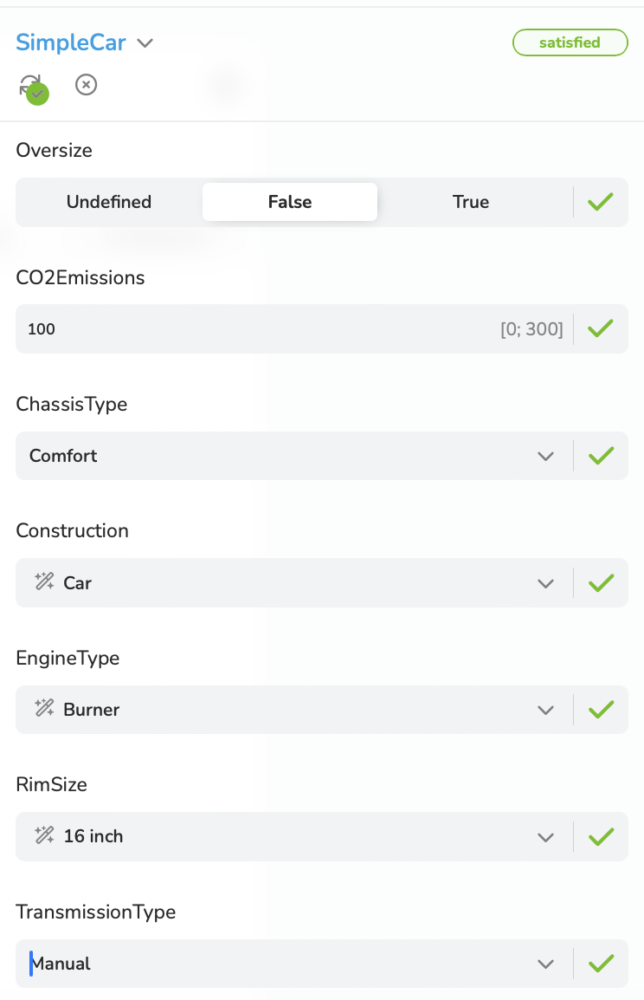

## 6.1 Configuration Dialogue without Components

We assume that the [*Session*](/glossary/#session) was initialized using the simple
[*Configuration Model*](/glossary/#configuration-model) ["SimpleCar"](/basic-workflow/initialization/#simple-car).

Now a first  [*Decision*](/glossary/#decision) can be done. For example, the Value of the Attribute
"CO2Emissions" is set to 100 (a [*Numeric Decision*](/glossary/#numeric-decision)):
```
PUT {{baseUrl}}/v2/session/configuration/decision<br>
X-SESSION-ID: {{sessionId}}<br>
Content-Type: application/json
```
```json
{
    "type": "Numeric",
    "attributeId": {
        "localId": "CO2Emissions",
        "componentPath": []
    },
    "state": "100"
}
```

The Consequences of the Decision are delivered by the response:

```json
{
  "consequences": {
    "isSatisfied": false,
    "choiceConsequences": [
      {
        "attributeId": {
          "localId": "EngineType",
          "componentPath": []
        },
        "isSatisfied": true,
        "cardinality": {
          "lowerBound": 1,
          "upperBound": 1
        },
        "values": [
          {
            "choiceValueId": "Burner",
            "possibleDecisionStates": [
              "Included"
            ]
          },
          {
            "choiceValueId": "Electric",
            "possibleDecisionStates": [
              "Excluded"
            ]
          }
        ]
      },
      {
        "attributeId": {
          "localId": "RimSize",
          "componentPath": []
        },
        "isSatisfied": true,
        "cardinality": {
          "lowerBound": 1,
          "upperBound": 1
        },
        "values": [
          {
            "choiceValueId": "16 inch",
            "possibleDecisionStates": [
              "Included"
            ]
          },
          {
            "choiceValueId": "18 inch",
            "possibleDecisionStates": [
              "Excluded"
            ]
          },
          {
            "choiceValueId": "25 inch",
            "possibleDecisionStates": [
              "Excluded"
            ]
          },
          {
            "choiceValueId": "28 inch",
            "possibleDecisionStates": [
              "Excluded"
            ]
          }
        ]
      }
    ],
    "numericConsequences": [],
    "booleanConsequences": [],
    "componentConsequences": []
  },
  "affectedDecisions": {
    "choiceDecisions": [
      {
        "attributeId": {
          "localId": "EngineType",
          "componentPath": []
        },
        "values": [
          {
            "choiceValueId": "Burner",
            "state": "Included",
            "kind": "Implicit"
          }
        ]
      },
      {
        "attributeId": {
          "localId": "RimSize",
          "componentPath": []
        },
        "values": [
          {
            "choiceValueId": "16 inch",
            "state": "Included",
            "kind": "Implicit"
          }
        ]
      }
    ],
    "numericDecisions": [
      {
        "attributeId": {
          "localId": "CO2Emissions",
          "componentPath": []
        },
        "state": 100.0,
        "kind": "Explicit"
      }
    ],
    "booleanDecisions": [],
    "componentDecisions": []
  }
}
```
According to the [*Constraint*](/glossary/#constraint):

```json
{
  "constraintId": "ElectricMeansCO2EmissionsNull",
  "textualConstraint": "EngineType.Electric -> CO2Emissions == 0"
}
```
the value *Burner* of the Attribute *EngineType* has  been automatically included meanwhile the value *Electric* has been excluded.


The visualized Configuration State after the Decision above is shown in figure 6-1:



Figure 6-1: A simple UI for the visualization of the Configuration State after a Decision

Now the outstanding Decisions are to be made that are still necessary for the
[*Configuration Model-Satisfaction State*](/glossary/#configuration-model-satisfaction-state) becomes *true* .

We use the route

PUT {{baseUrl}}/v2/session/configuration/decision/many<br>
X-SESSION-ID: {{sessionId}}<br>
Content-Type: application/json

to set more that one Decision.

The exemplary request body for the current example:

```json
{
  "mode": {
        "type": "Default"
    },
  "choiceDecisions": [
    {
      "attributeId": {
        "localId": "ChassisType",
        "componentPath": []
      },
      "type": "Choice",
      "choiceValueId": "Comfort",
      "state": "Included"
    },
    {
      "attributeId": {
        "localId": "TransmissionType",
        "componentPath": []
      },
      "type": "Choice",
      "choiceValueId": "Manual",
      "state": "Included"
    }
  ],
  "numericDecisions": [],
  "booleanDecisions": [
    {
      "attributeId": {
        "localId": "Oversize",
        "componentPath": []
      },
      "type": "Boolean",
      "state": false
    }
  ],
  "componentDecisions": []
}
```
The response delivers the Consequences which need to be evaluate by a [*Configurator*](/glossary/#configurator).

```json
{
  "consequences": {
    "isConfigurationSatisfied": true,
    "canAttributeContributeToConfigurationSatisfaction": [],
    "choiceConsequences": [
      {
        "attributeId": {
          "localId": "ChassisType",
          "componentPath": []
        },
        "isSatisfied": true,
        "cardinality": {
          "lowerBound": 1,
          "upperBound": 1
        },
        "values": [
          {
            "choiceValueId": "Comfort",
            "possibleDecisionStates": [
              "Included"
            ]
          },
          {
            "choiceValueId": "Sport",
            "possibleDecisionStates": [
              "Included",
              "Excluded"
            ]
          }
        ]
      },
      {
        "attributeId": {
          "localId": "TransmissionType",
          "componentPath": []
        },
        "isSatisfied": true,
        "cardinality": {
          "lowerBound": 1,
          "upperBound": 1
        },
        "values": [
          {
            "choiceValueId": "Automatic",
            "possibleDecisionStates": [
              "Included",
              "Excluded"
            ]
          },
          {
            "choiceValueId": "Manual",
            "possibleDecisionStates": [
              "Included"
            ]
          }
        ]
      }
    ],
    "numericConsequences": [],
    "booleanConsequences": [
      {
        "attributeId": {
          "localId": "Oversize",
          "componentPath": []
        },
        "isSatisfied": true,
        "selection": "Mandatory",
        "possibleDecisionStates": [
          false,
          true
        ]
      }
    ],
    "componentConsequences": []
  },
  "affectedDecisions": {
    "choiceDecisions": [
      {
        "attributeId": {
          "localId": "ChassisType",
          "componentPath": []
        },
        "values": [
          {
            "choiceValueId": "Comfort",
            "state": "Included",
            "kind": "Explicit"
          }
        ]
      },
      {
        "attributeId": {
          "localId": "TransmissionType",
          "componentPath": []
        },
        "values": [
          {
            "choiceValueId": "Manual",
            "state": "Included",
            "kind": "Explicit"
          }
        ]
      }
    ],
    "numericDecisions": [],
    "booleanDecisions": [
      {
        "attributeId": {
          "localId": "Oversize",
          "componentPath": []
        },
        "state": false,
        "kind": "Explicit"
      }
    ],
    "componentDecisions": []
  },
  "rejectedDecisions": {
    "choiceDecisions": [],
    "numericDecisions": [],
    "booleanDecisions": [],
    "componentDecisions": []
  }
}
```

The Configuration Model is satisfied (*"isConfigurationSatisfied": true*), all Attributes are satisfied (*"isSatisfied": true*),
there are no [*Rejected Decisions*](/glossary/#rejected-decision).

An exemplary visualization is shown in figure 6-2:




Figure 6-2: A simple UI for the visualization of the Configuration State that is satisfied
