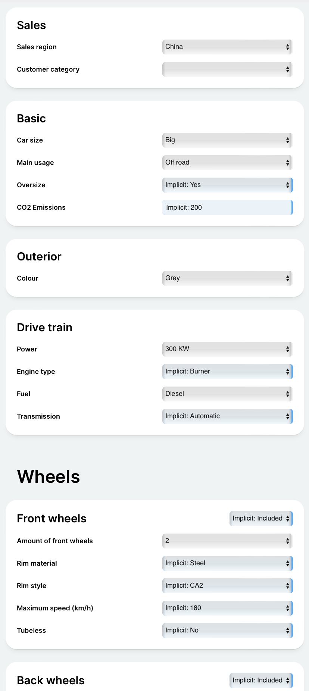
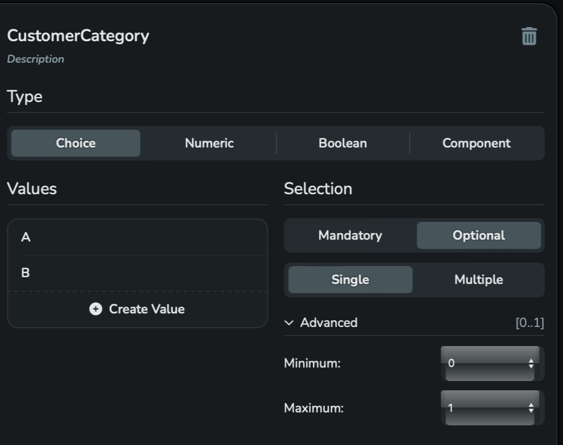
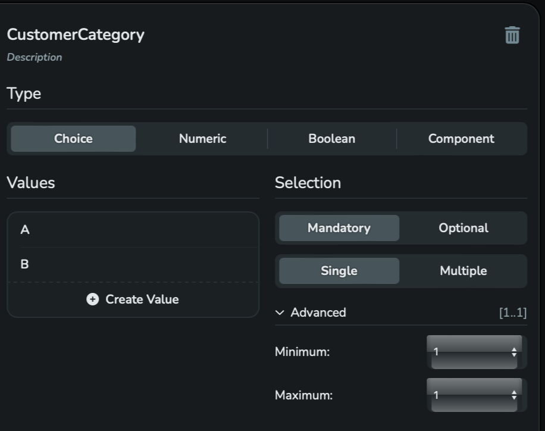
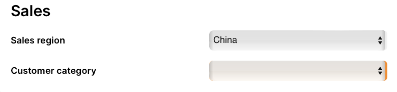

## 8.1 Why is an Attribute not satisfied

An exemplary starting situation after a configuration, that means after selecting Values for the Configuration Attributes:


Fig. 8-1: An exemplary initial state after a configuration

We assume that this state has been saved so that it can be reloaded later.
Before such loading, changes are made to the Configuration Model - usually by other people.
For example, the Attribute "Customer category"  is to be given a different cardinality
as shown in the figures 8-2 and 8-3.


Fig. 8-2: The Attribute "Customer category" with optional assignment


Fig. 8-3: The Attribute "Customer category" with mandatory assignment

Assumption:

During the restoring of the [*Configuration State*](/glossary/#configuration-state) shown above, this change in the declaration of
the  Attribute "Customer category" is not taken into account.

During the restoring the following request with a [*Multiple Decision*](/glossary/#multiple-decision)
is executed:

```json
PUT {{baseUrl}}/engine/v2/session/configuration/decision/many
X-SESSION-ID: {{sessionId}}
Content-Type: application/json

{
    "mode": {
        "type": "DropExistingDecisions",
        "conflictResolution": {
            "type": "Manual",
            "includeConstraintsInConflictExplanation": true
        }
    },
    "choiceDecisions": [
        {
            "type": "Choice",
            "attributeId": {
                "localId": "SalesRegion",
                "sharedConfigurationModelId": "SalesShared",
                "componentPath": []
            },
            "choiceValueId": "China",
            "state": "Included"
        },
        {
            "type": "Choice",
            "attributeId": {
                "localId": "CarSize",
            },
            "choiceValueId": "Big",
            "state": "Included"
        },
        {
            "type": "Choice",
            "attributeId": {
                "localId": "Usage",
                "sharedConfigurationModelId": "TechnicalShared",
                "componentPath": []
            },
            "choiceValueId": "Off road",
            "state": "Included"
        },
        {
            "type": "Choice",
            "attributeId": {
                "localId": "Size",
                "sharedConfigurationModelId": "TechnicalShared",
                "componentPath": []
        },
            "choiceValueId": "18 inch",
            "state": "Included"
        },
        {
            "type": "Choice",
            "attributeId": {
                "localId": "Colour",
                "componentPath": ["Automobile"]
            },
            "choiceValueId": "Grey",
            "state": "Included"
        },
        {
            "type": "Choice",
            "attributeId": {
                "localId": "Power",
                "componentPath": ["Automobile", "Engine"]
            },
            "choiceValueId": "300 KW",
            "state": "Included"
        },
        {
            "type": "Choice",
            "attributeId": {
                "localId": "FuelType",
                "componentPath": ["Automobile", "Engine"]
            },
            "choiceValueId": "Diesel",
            "state": "Included"
        },
        {
            "type": "Choice",
            "attributeId": {
                "localId": "NumberOfWheels",
                "componentPath": ["Automobile"]
            },
            "choiceValueId": "2",
            "state": "Included"
        }
    ],
    "numericDecisions": [],
    "booleanDecisions": [],
    "componentDecisions": []
}
```
A section of the Consequences:

```json
{
  "consequences": {
    "isConfigurationSatisfied": false,
    "canAttributeContributeToConfigurationSatisfaction": [],
    "choiceConsequences": [],
    "numericConsequences": [],
    "booleanConsequences": [],
    "componentConsequences": []
  },
```
The configuration is not satisfied. Why it is not satisfied?
The response of the following route indicates the cause:

```json
POST {{baseUrl}}/engine/v2/session/configuration/consequence/explain/why-not-satisfied
X-SESSION-ID: {{sessionId}}
Content-Type: application/json

{
  "type": "Attribute",
  "attributeId": {
    "localId": "CustomerCategory",
    "sharedConfigurationModelId": "SalesShared",
    "componentPath": []
  }
}
```
Response:
```json
{
  "constraintExplanations": [
    {
      "causedByCardinalities": [
        {
          "type": "Cardinality",
          "attributeId": {
            "localId": "CustomerCategory",
            "sharedConfigurationModelId": "SalesShared",
            "componentPath": []
          }
        }
      ],
      "causedByRules": []
    }
  ],
  "decisionExplanations": []
}
```
The [*Cardinality*](/glossary/#cardinality) of the "CustomerCategory" Attribute that was changed to (1:1)
is not satisfied because no Value was assigned.

A possible visual representation of this state is the orange marker on the right-hand side
of the select box, as shown in figure 8-4.



Fig. 8-4: The "Customer category" select box marked as "not satisfied"

