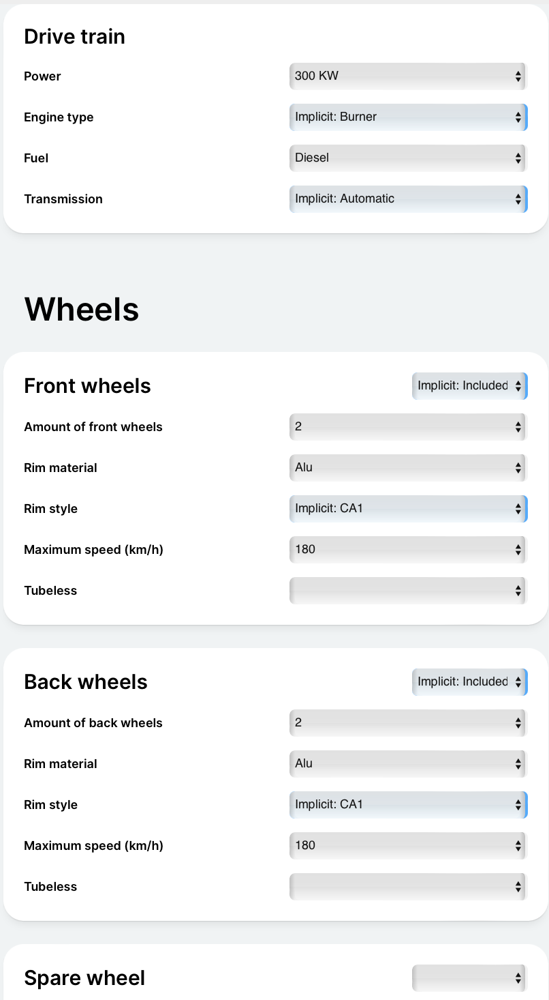
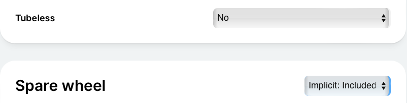

## 8.2 Why is the Configuration Model is not satisfied

An exemplary starting situation after a configuration, that means after selecting Values for the Configuration Attributes:


Fig. 8-5: An exemplary initial state after a configuration

All [*Attributes*](/glossary/#attribute) are satisfied. But - as shown the Consequences -
the [*Configuration Model*](/glossary/#configuration-model) as a whole is not satisfied yet.
Why not?

Get the [*Consequences*](/glossary/#consequence):

```json
### Get consequences
GET {{baseUrl}}/engine/v2/session/configuration/consequence
X-SESSION-ID: {{sessionId}}
Content-Type: application/json
```

A section of the Consequences:

```json
{
  "isConfigurationSatisfied": false,
  "canAttributeContributeToConfigurationSatisfaction": [
    {
      "localId": "Tubeless",
      "sharedConfigurationModelId": "TechnicalShared",
      "componentPath": []
    },
    {
      "localId": "SpareWheel",
      "componentPath": ["Automobile"]
    }
  ],
  "choiceConsequences": [
    {
      "attributeId": {
        "localId": "CarSize",
        "componentPath": []
      },
      "isSatisfied": true,
      "cardinality": {
        "lowerBound": 1,
        "upperBound": 1
      },
      "values": [
        {
          "choiceValueId": "Big",
          "possibleDecisionStates": [
            "Included"
          ]
        },
```
Each of the Attributes is satisfied but the Configuration Model is not
satisfied ("isConfigurationSatisfied": false).
The Consequences provide the indication that the two  optional Attributes can contribute to
satisfying the Configuration Model: "Tubeless" and "SpareWheel".

This is caused by [*Rule*](/glossary/#rule) 16, which requires that either the
[*Component Attribute*](/glossary/#component-attribute) "SpareWheel"  is selected or the
[*Boolean Attribute*](/glossary/#boolean-attribute) "Tubeless" is set to "true".

```json
{
  "constraintId": "Rule16:TubelessTiresWithoutSpereWheel",
  "textualConstraint": "shared::TechnicalShared::Tubeless OR SpareWheel"
}
```
"No" is now selected for "Tubeless". This has the effect that the "SpareWheel" component
is implicitly included, as seen in figure 8-6.


Fig. 8-6: "Tubeless" explicitly selected and "SpareWheel" implicitly included

Now the question again: Why is the Configuration Model not satisfied?
```json
POST {{baseUrl}}/engine/v2/session/configuration/consequence/explain/why-not-satisfied
X-SESSION-ID: {{sessionId}}
Content-Type: application/json

{
    "type": "Configuration"
}
```
The response:
```json
{
  "type": "ExplainConflict",
  "title": "ExplainConflict",
  "status": 409,
  "detail": ""
}
```
Since the Configuration Model is now satisfied, the request "Why NOT satisfied Configuration"
provides the status code 409 with the title "ExplainConflict".

A little section of the Consequences shows the state of the Configuration Model:
```json
{
  "isConfigurationSatisfied": true,
  "canAttributeContributeToConfigurationSatisfaction": [],
  "choiceConsequences": [
    {
      "attributeId": {
        "localId": "CarSize",
        "componentPath": []
      },
      "isSatisfied": true,
      ...
```
