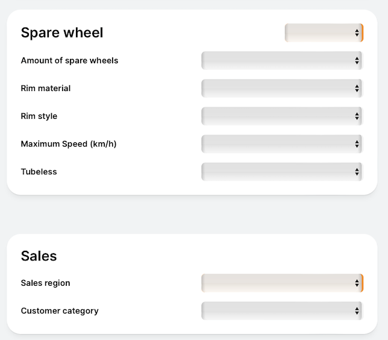
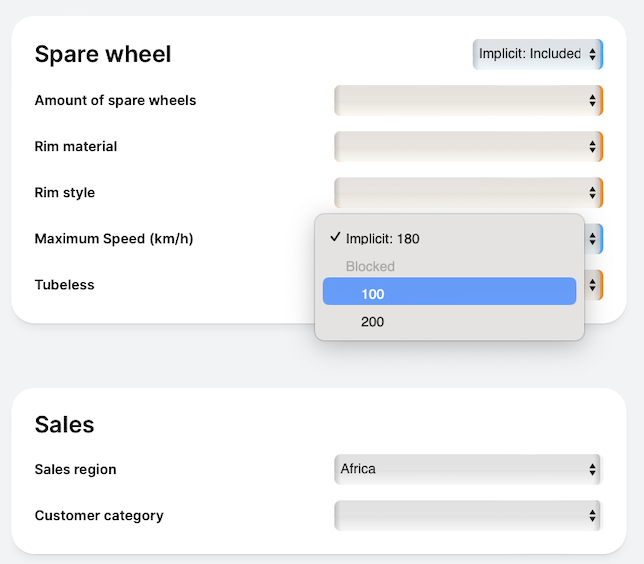
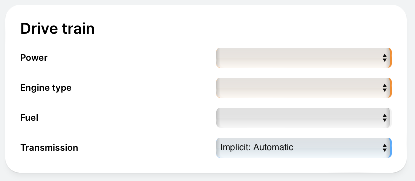
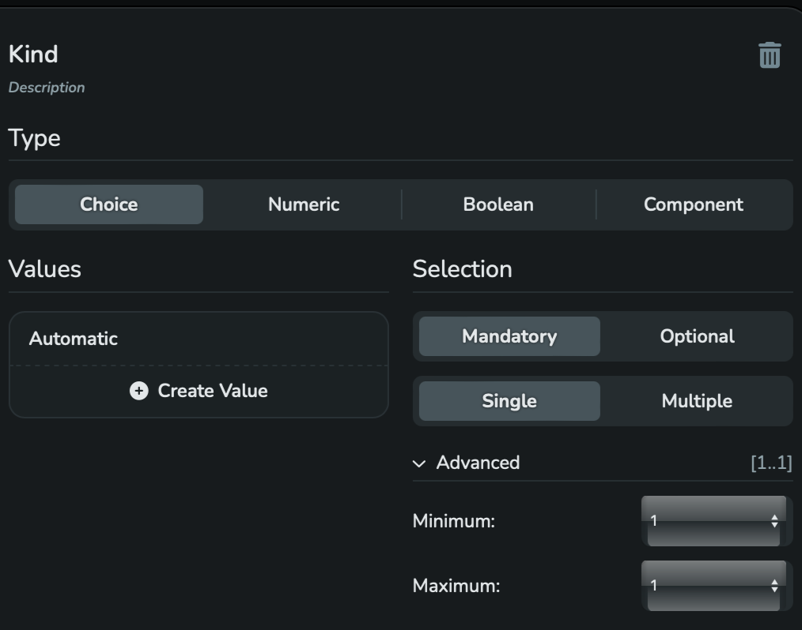

## 8.3 Why is a state is not possible

The initial situation after calling up the [*Configurator*](/glossary/#configurator):

The Attributes of the instance of the [*Component Configuration Model*](/glossary/#component-configuration-model) "Wheel"
which is labelled with "SpareWheel" are satisfied.
As the orange marker on the right-hand side of the select box shows, only the instance "SpareWheel"
itself still needs to be included or excluded.



Fig. 8-7: Initial state after calling up the Configurator

The value "Africa" should now be selected for "Sales region".
Reminder: Technically, this means the following request:
```json
PUT {{baseUrl}}/engine/v2/session/configuration/decision
X-SESSION-ID: {{sessionId}}
Content-Type: application/json

{
    "type": "Choice",
    "attributeId": {
        "localId": "SalesRegion",
        "sharedConfigurationModelId": "SalesShared"
    },
    "choiceValueId": "Africa",
    "state": "Included"
}
```
As a result of the request, the "SpareWheel" component is automatically "Included" and the Value "180"
is automatically set for "Maximum speed".

Reminder: Both are [*Implicit Decisions*](/glossary/#implicit-decision) of the
[*Configuration Engine*](/glossary/#configuration-engine) because of the [*Rules*](/glossary/#rule):
[*Rule 19*](/exemplary-configuration-dialogues/with-comp/rules/#rule1), [*Rule 24*](/exemplary-configuration-dialogues/with-comp/rules/#rule1)
and [*Rule 25*](/exemplary-configuration-dialogues/with-comp/rules/#rule25).


Fig. 8-8: Configuration State after choosing "Africa" for "Sales region"

The Configuration Engine should now provide an [*Explanation*](/glossary/#explanation) as to why the
Value "200" cannot be selected.
The Configurator must send the following request for this:
```json
POST {{baseUrl}}/engine/v2/session/configuration/consequence/explain/why-state-not-possible
X-SESSION-ID: {{sessionId}}
Content-Type: application/json

{
    "type": "ChoiceValue",
    "attributeId": {
        "localId": "MaximumSpeed",
        "componentPath": [
            "Automobile",
            "SpareWheel",
            "Tire"
        ]
    },
    "choiceValueId": "200",
    "state": "Included"
}
```
The response delivers the following JSON structure:

```json
{
  "constraintExplanations": [
    {
      "causedByCardinalities": [],
      "causedByRules": [
        {
          "type": "Rule",
          "constraintId": {
            "localId": "Rule25:MaximumSpeed200NotForAfrica",
            "configurationModelId": "Tire"
          }
        }
      ]
    }
  ],
  "decisionExplanations": [
    {
      "causedByChoiceDecisions": [
        {
          "type": "Choice",
          "choiceValueId": "Africa",
          "state": "Included",
          "attributeId": {
            "localId": "SalesRegion",
            "sharedConfigurationModelId": "SalesShared",
            "componentPath": []
          },
          "reason": "StateNotPossible"
        }
      ],
      "causedByNumericDecisions": [],
      "causedByBooleanDecisions": [],
      "causedByComponentDecisions": []
    }
  ]
}
```
As a result of the above Decision, [*Rule 25*](/exemplary-configuration-dialogues/with-comp/rules/#rule25)
applies, which excludes the value "200" for "Africa".


The Configuration Engine should now provide an Explanation as to why the
Value "Car" of the "Construction" Attribute cannot be deselected.
The Configurator must send the following request for this:
```json
POST {{baseUrl}}/engine/v2/session/configuration/consequence/explain/why-state-not-possible
X-SESSION-ID: {{sessionId}}
Content-Type: application/json

{
  "type": "ChoiceValue",
  "attributeId": {
    "localId": "Construction",
    "sharedConfigurationModelId": "TechnicalShared",
    "componentPath": []
    },
    "choiceValueId": "Car",
    "state": "Excluded"
}
```
The response delivers the following JSON structure:

```json
{
  "constraintExplanations": [
    {
      "causedByCardinalities": [],
      "causedByRules": [
        {
          "type": "Rule",
          "constraintId": {
            "localId": "Rule1:TheConstructionIsCar",
            "configurationModelId": "Car"
          }
        }
      ]
    }
  ],
  "decisionExplanations": []
}
```
[*Rule 1*](/exemplary-configuration-dialogues/with-comp/rules/#rule1) is responsible.


To show another type of Explanation, the Value "Manual" of the Attribute "Child"  is now removed
from the Component Configuration Model "Transmission" . This is represented in the UI as shown in Figure 8.y.


Fig. 8-9: State for "Transmission" after calling up the Configurator

The Configuration Engine should now be asked why "Automatic" cannot be excluded.

The following request is sent:
```json
POST {{baseUrl}}/engine/v2/session/configuration/consequence/explain/why-state-not-possible
X-SESSION-ID: {{sessionId}}
Content-Type: application/json

{
    "type": "ChoiceValue",
    "attributeId": {
        "localId": "Kind",
        "componentPath": [
            "Automobile",
            "Transmission"
        ]
    },
    "choiceValueId": "Automatic",
    "state": "Excluded"
}
```

The response delivers:

```json
{
  "constraintExplanations": [
    {
      "causedByCardinalities": [
        {
          "type": "Cardinality",
          "attributeId": {
            "localId": "Kind",
            "componentPath": [
              "Automobile",
              "Transmission"
            ]
          }
        }
      ],
      "causedByRules": []
    }
  ],
  "decisionExplanations": []
}
```


Fig. 8-10: The declaration of the Attribute "Kind" in the Configuration Model Developer

As you can see in Figure 8-y, "Kind" is a [*Choice Attribute*](/glossary/#choive-attribute) for which
exactly one Value must be assigned. Since only one Value is available, the Configuration Engine makes a
corresponding [*Implicit Decision*](/glossary/#implicit-decision).


