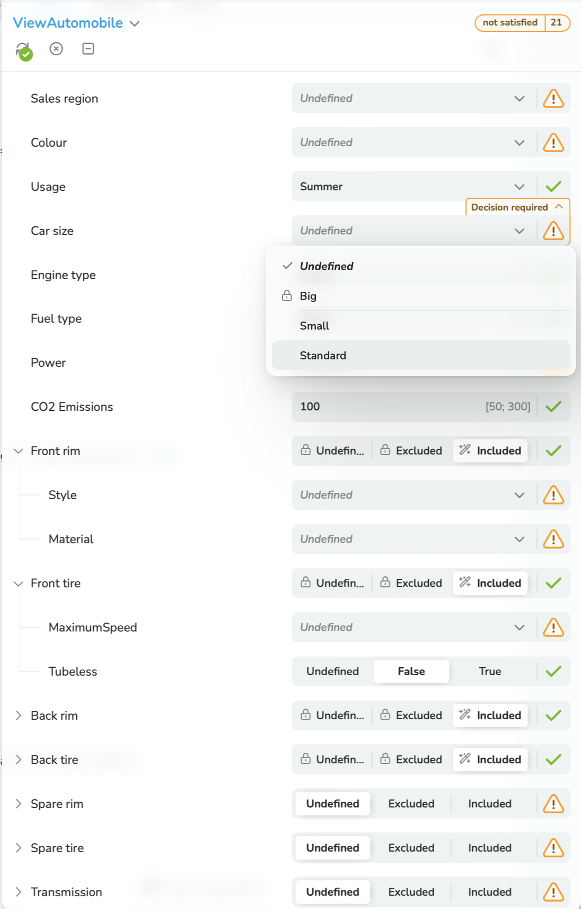
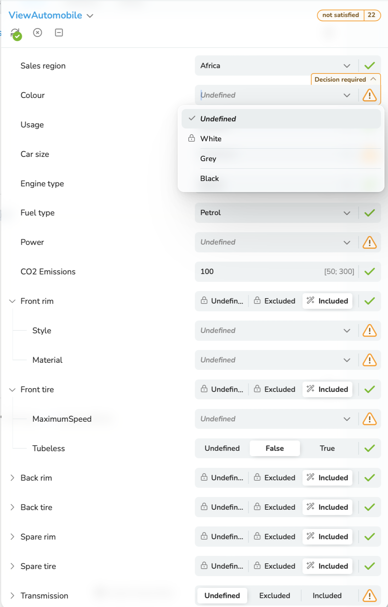

<a id ="rule-added"></a>
### 7.2.3 One Rule has been added
If a [*Rule*](/glossary/#rule) has been removed, this is not critical because only restrictions are removed
and values cannot be set implicitly by the [*Configuration Engine*](/glossary/#configuration-engine).
(Effects from the perspective of the application domain are not considered here).

If one or more Rules have been added, this can have an effect on the [*Configuration State*](/glossary/#configuration-state) that is to be restored.

If the new Rule only contains values that have not yet been selected, this has no effect on the Configuration State to be restored.

If the new Rule contains values that have already been selected within the previous [*Configuration Dialogue*](/glossary/#configuration-dialogue),
then this can have effect on the Configuration State to be restored.

The following example will demonstrate this.

The Rule that has been added after a final Configuration Dialogue, i. e. after saving the Configuration State:

```

{
  "constraintId": "Rule26:TheColourWhiteIsNotSoldInAfrica.",
  "textualConstraint": "shared::SalesShared::SalesRegion.Africa -> !Automobile::Colour.White"
}
```
The initialization of the [*Configuration Session*](/glossary/#configuration-session):


Response code: 409;
The response body of the request with many Decisions if "includeConstraintsInConflictExplanation": true and
"conflictResolution": Manual:
```json
{
  "constraintExplanations": [
    {
      "causedByCardinalities": [],
      "causedByRules": [
        {
          "type": "Rule",
          "constraintId": {
            "localId": "Rule26:TheColourWhiteIsNotSoldInAfrica.",
            "configurationModelId": "Car"
          }
        }
      ]
    }
  ],
  "decisionExplanations": [
    {
      "causedByChoiceDecisions": [
        {
          "type": "Choice",
          "choiceValueId": "White",
          "state": "Included",
          "attributeId": {
            "localId": "Colour",
            "componentPath": [
              "Automobile"
            ]
          },
          "reason": "StateNotPossible"
        }
      ],
      "causedByNumericDecisions": [],
      "causedByBooleanDecisions": [],
      "causedByComponentDecisions": []
    },
    {
      "causedByChoiceDecisions": [
        {
          "type": "Choice",
          "choiceValueId": "Africa",
          "state": "Included",
          "attributeId": {
            "localId": "SalesRegion",
            "sharedConfigurationModelId": "SalesShared",
            "componentPath": []
          },
          "reason": "StateNotPossible"
        }
      ],
      "causedByNumericDecisions": [],
      "causedByBooleanDecisions": [],
      "causedByComponentDecisions": []
    }
  ]
}
```

The response body of the request with many Decisions if "includeConstraintsInConflictExplanation": false and
"conflictResolution": Manual
```json
{
  "constraintExplanations": [],
  "decisionExplanations": [
    {
      "causedByChoiceDecisions": [
        {
          "type": "Choice",
          "choiceValueId": "White",
          "state": "Included",
          "attributeId": {
            "localId": "Colour",
            "componentPath": [
              "Automobile"
            ]
          },
          "reason": "StateNotPossible"
        }
      ],
      "causedByNumericDecisions": [],
      "causedByBooleanDecisions": [],
      "causedByComponentDecisions": []
    },
    {
      "causedByChoiceDecisions": [
        {
          "type": "Choice",
          "choiceValueId": "Africa",
          "state": "Included",
          "attributeId": {
            "localId": "SalesRegion",
            "sharedConfigurationModelId": "SalesShared",
            "componentPath": []
          },
          "reason": "StateNotPossible"
        }
      ],
      "causedByNumericDecisions": [],
      "causedByBooleanDecisions": [],
      "causedByComponentDecisions": []
    }
  ]
}
```
The visualisation of the variant "manual [*Conflict*](/glossary/#conflict) resolution":
Nothing is selected for "Sales region" and "Colour". Manual intervention is required.



Figure 7-1: Neither "Sales region" nor "Colour" are selected


The response body of the request with many Decisions if "includeConstraintsInConflictExplanation": true / false and
"conflictResolution": Automatic
Code: 200
```json
"affectedDecisions":
{
        "attributeId": {
          "localId": "SalesRegion",
          "sharedConfigurationModelId": "SalesShared",
          "componentPath": []
        },
        "choiceValueId": "Africa",
        "state": "Included",
        "kind": "Explicit"
      }
```
```json
"rejectedDecisions": {
    "booleanDecisions": [],
    "numericDecisions": [],
    "componentDecisions": [],
    "choiceValueDecisions": [
      {
        "attributeId": {
          "localId": "Colour",
          "componentPath": [
            "Automobile"
          ]
        },
        "choiceValueId": "White",
        "state": "Included",
        "kind": "Explicit"
      }
    ]
  }
```

The visualisation of the variant "automatic Conflict resolution":
"Africa" is selected for "Sales region" and nothing is selected for "Colour".



Figure 7-2: "Sales region" is selected "Colour" not
